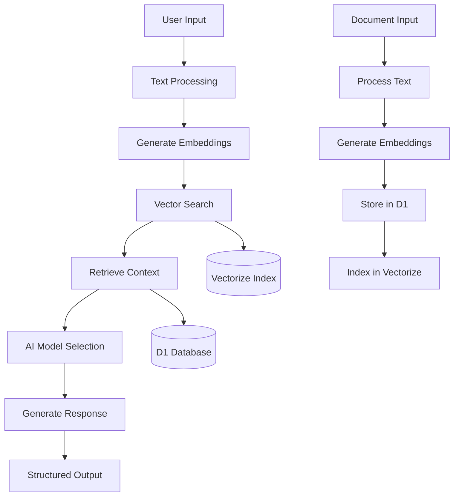

# RAG AI Tutorial

[](https://rag-ai-tutorial.jungno.workers.dev)
[](https://workers.cloudflare.com)
[](https://hono.dev)

## About

AI-driven Edge Computing RAG API using Opensoure AI LLMs.  Vectorized index with Semantic Search using Meta Llama 3 Instruct and Baai Embedding Model.

This project demonstrates a complete **Retrieval-Augmented Generation (RAG) system** implementation using Cloudflare's serverless edge computing stack. The system combines traditional database storage with vector embeddings to create an intelligent knowledge base that can understand context, perform semantic search, and generate AI-powered responses.

**Live Demo**: [https://rag-ai-tutorial.jungno.workers.dev](https://rag-ai-tutorial.jungno.workers.dev)

## Topics

**Core Technologies:**
- `cloudflare-workers` `serverless` `edge-computing` `javascript` `typescript`
- `hono` `rest-api` `web-framework` `middleware`

**AI & Machine Learning:**
- `retrieval-augmented-generation` `rag` `vector-database` `semantic-search`
- `embeddings` `llm` `ai-integration` `natural-language-processing`

**Database & Storage:**
- `cloudflare-d1` `sqlite` `vectorize` `database-migrations`
- `vector-similarity` `knowledge-base` `document-storage`

**Development:**
- `vitest` `testing` `ci-cd` `workflow-automation`
- `api-design` `production-ready` `monitoring`

**Architecture:**
- `microservices` `agent-pattern` `modular-design` `scalable-architecture`

## Project Structure

```
workers-rag/
├── src/
│   ├── index.js                 # Main Hono application with REST API endpoints
│   ├── vectorize.js            # RAG workflow implementation & durable execution
│   └── agents/                 # Modular search agent architecture
│       ├── base-agent.js       # Abstract base class for extensible search strategies
│       └── vector-agent.js     # Semantic vector similarity search implementation
├── test/
│   └── index.spec.js           # Comprehensive test suite with Workers test utilities
├── migrations/
│   └── 0001_initial_setup.sql  # Database schema and migration scripts
├── docs/
│   └── specs/                  # Technical specifications and documentation
│       ├── testing.md          # Testing strategies and scenarios
│       ├── vectorize.md        # Vector search implementation details
│       └── index.md            # Architecture overview
├── wrangler.jsonc              # Cloudflare Workers configuration with all bindings
├── vitest.config.js            # Test configuration for Workers environment
├── package.json                # Dependencies, scripts, and project metadata
└── README.md                   # This file - project documentation
```

### Key Components

- **API Layer** (`src/index.js`): Hono.js application with command discovery, health monitoring, and structured responses
- **RAG Engine** (`src/vectorize.js`): Workflow-based document processing with embedding generation and storage
- **Agent System** (`src/agents/`): Extensible search architecture supporting multiple retrieval strategies
- **Database** (`migrations/`): D1 SQLite with proper schema management and versioning
- **Testing** (`test/`): Vitest with Cloudflare Workers pool for realistic integration testing

## Key Features (AI Flow)

### 🧠 Intelligent Question Answering
- **Dual AI Models**: Fast responses (Llama-3.2-1B) vs. complex reasoning (Llama-3.1-70B)
- **Context-Aware Generation**: Retrieves relevant knowledge before generating responses
- **Semantic Understanding**: Uses vector embeddings for meaning-based content matching

### 🔍 Advanced Search Capabilities
- **Vector Similarity Search**: 768-dimensional embeddings with cosine similarity
- **Hybrid Retrieval**: Combines semantic search with traditional filtering
- **Intelligent Ranking**: Similarity threshold filtering (0.5) with score-based sorting

### 📚 Knowledge Management
- **Document Ingestion**: RESTful API for adding knowledge to the system
- **Automatic Indexing**: Workflow-driven embedding generation and vector storage
- **Persistent Storage**: D1 database for document text with Vectorize for searchable vectors

### 🌐 Production-Ready Architecture
- **Global Edge Deployment**: Sub-100ms latency via Cloudflare's 300+ locations
- **Auto-Scaling**: Handles traffic spikes with zero configuration
- **Comprehensive Monitoring**: Built-in health checks, logging, and error tracking
- **Command Discovery**: Structured API metadata for UI integration

### RAG Processing Flow



**Step-by-Step Process:**

1. **Document Ingestion**: Text content processed through workflow system
2. **Embedding Generation**: AI model converts text to 768-dimensional vectors  
3. **Dual Storage**: Original text in D1, embeddings in Vectorize
4. **Query Processing**: User questions converted to embeddings for similarity search
5. **Context Retrieval**: Most relevant documents retrieved based on vector similarity
6. **AI Generation**: Selected model generates response using retrieved context
7. **Response Delivery**: Structured JSON with answer, context, and metadata

## Future Enhancements

### 🎯 Short-term Roadmap (Next 2-3 months)

- **Multi-Modal Support**: Add image and document upload capabilities
- **Advanced Agents**: Implement keyword search and metadata filtering agents
- **Batch Operations**: Bulk document import and processing workflows
- **Rate Limiting**: Request throttling and usage tracking
- **Authentication**: API key management and user access controls

### 🚀 Medium-term Goals (3-6 months)

- **Conversation Memory**: Multi-turn dialogue with context preservation
- **Custom Models**: Support for additional AI model providers
- **Advanced Analytics**: Usage metrics, performance monitoring dashboard
- **Webhook Integration**: Real-time notifications for document processing
- **Query Optimization**: Caching layer and response time improvements

### 🌟 Long-term Vision (6+ months)

- **Enterprise Features**: Multi-tenant architecture with organization management
- **Advanced RAG Techniques**: Hypothetical document embeddings, query expansion
- **Real-time Collaboration**: Live document editing and knowledge sharing
- **Mobile SDK**: Native mobile app integration capabilities  
- **AI Agents Marketplace**: Plugin system for custom search and processing agents

### 🔧 Technical Debt & Infrastructure

- **Performance Optimization**: Query response time improvements (<100ms target)
- **Scalability Testing**: Load testing for high-volume scenarios (10k+ requests/min)
- **Security Hardening**: Input sanitization, SQL injection protection
- **Documentation**: Interactive API explorer and SDK documentation
- **CI/CD Pipeline**: Automated testing, deployment, and rollback capabilities

---

## Quick Start

### Prerequisites
- Node.js 18+ and npm
- Cloudflare account with Workers enabled
- Wrangler CLI (`npm i -g wrangler`)

### Installation

```bash
# Clone and setup
git clone <repository-url>
cd rag-ai-tutorial
npm install

# Cloudflare setup
npx wrangler login
npx wrangler d1 create rag-ai
npx wrangler vectorize create vector-index --dimensions=768 --metric=cosine
```

### Development

```bash
# Local development
npm run dev

# Remote development (recommended)
npx wrangler dev --remote

# Apply database migrations
npx wrangler d1 migrations apply rag-ai --remote
```

### API Examples

```bash
# Ask a question with context
curl "https://rag-ai-tutorial.jungno.workers.dev/?text=What%20is%20machine%20learning&model=llama-70b"

# Add knowledge to the system  
curl -X POST https://rag-ai-tutorial.jungno.workers.dev/notes \
  -H "Content-Type: application/json" \
  -d '{"text": "Machine learning enables computers to learn from data without explicit programming."}'

# Search the knowledge base
curl "https://rag-ai-tutorial.jungno.workers.dev/search?q=artificial%20intelligence"
```

### Testing & Deployment

```bash
# Run test suite
npm test

# Deploy to production
npm run deploy

# Monitor logs
npx wrangler tail --format pretty
```

## Documentation

- **[API Reference](https://rag-ai-tutorial.jungno.workers.dev/help)** - Interactive endpoint documentation
- **[Testing Guide](./docs/specs/testing.md)** - Testing strategies and scenarios
- **[Architecture Docs](./docs/specs/)** - Technical implementation details

## Resources

- **[Cloudflare Workers AI](https://developers.cloudflare.com/workers-ai/)** - AI platform documentation
- **[Hono.js Framework](https://hono.dev/)** - Web framework documentation  
- **[Original Tutorial](https://developers.cloudflare.com/workers-ai/guides/tutorials/build-a-retrieval-augmented-generation-ai/)** - Cloudflare's RAG guide

---

## Contributing

This project demonstrates production-ready RAG implementation patterns. Feel free to use it as a foundation for your own AI-powered applications or contribute improvements via pull requests.

## License

MIT License - see LICENSE file for details.